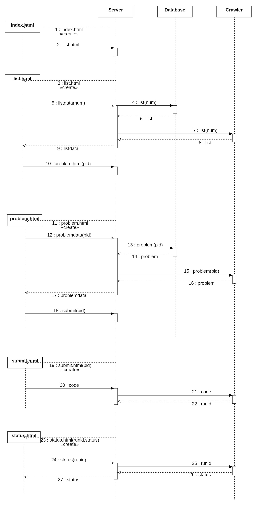

# XOJ需求规格说明书



## Database
[ ] SELECT Bug
[ ] 空行和缩进：类名和函数有一个空行，函数之间一个空行
[ ] 删掉注释
[ ] SQL语句规范
[ ] 每行不过长（80字符）
[ ] 异常业务：异常处理
[ ] 需不需要随时打印状态信息

## Server
[ ] 文件名 首字母大写
[ ] 空行和缩进：import后加一个空行，类名和函数有一个空行，函数之间一个空行
[ ] get全部不写，post单独加
[ ] 注释先不做要求
[ ] 请求html 加后缀，请求数据，不加后缀
[ ] 函数名，尽量全部一致
[ ] get方式，从url中获取数据
[ ] post方式，获取code等...
```txt
/listdata?num=<num:int>
```
